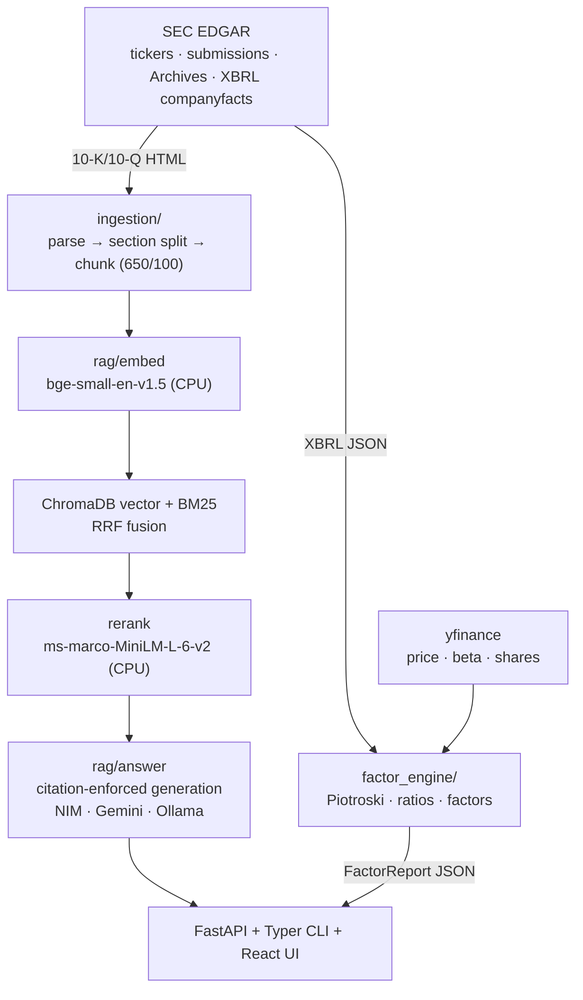

# StockRAG — Factor Engine + Ask-My-Docs RAG for SEC Filings

[](https://github.com/rajyyug1132/stockrag/actions/workflows/eval.yml)

[](LICENSE)

Ask a chatbot for Apple's Piotroski F-Score and you get a confident number
with no provenance. Ask it what the EU said about Irish state aid and you get
a summary of what it remembers reading in 2023.

Apple's last 10-K is 100+ pages of prose, and the numbers behind it live in a
separate XBRL exhibit nobody reads by hand. StockRAG treats those as two
different problems and refuses to blur them:

- **Numbers are computed, never generated.** The factor engine pulls SEC EDGAR
  XBRL (`companyfacts`) and calculates Piotroski F-Score (2000), Novy-Marx
  gross profitability (2013), Fama-French/Carhart characteristics, ROE, net
  margin, P/E, P/FCF and beta. No LLM touches an arithmetic path. Fields a
  source can't supply come back flagged in `missing` rather than guessed.
- **Prose answers must cite or die.** 10-K/10-Q text is chunked along Item
  boundaries, retrieved by hybrid BM25 + vector search fused with RRF, then
  rescored by a cross-encoder. If the generated answer contains no `[n]`
  marker pointing at a retrieved chunk, `rag/answer.py` throws it away and
  returns a refusal. Sounding right is not a passing grade.

The interesting engineering is in the second bullet. A RAG demo that answers
every question is easy. One that knows when the filing simply doesn't say is
what needed the eval harness, and what CI now blocks merges on.

## What an answer looks like

```
$ uv run stockrag ask "What did the European Commission decide about Ireland
                       granting state aid to Apple?" AAPL

The European Commission decided on August 30, 2016, that Ireland granted state
aid to Apple by providing tax opinions in 1991 and 2007 concerning the tax
allocation of profits of the Irish branches of two subsidiaries [1]. The
Commission ordered Ireland to recover additional taxes for June 2003 through
December 2014 [1]. The General Court annulled that decision on July 15, 2020
[1]. The ECJ set aside the General Court's judgment on September 10, 2024 and
confirmed the 2016 decision [1], and Apple recorded a one-time income tax
charge of $10.2 billion in Q4 2024 [1].

Sources:
  [1] 10-K filed 2025-10-31 - other (0000320193-25-000079)
  [2] 10-K filed 2025-10-31 - item_1a_risk_factors (0000320193-25-000079)
  [3] 10-K filed 2025-10-31 - item_1a_risk_factors (0000320193-25-000079)
  [4] 10-K filed 2025-10-31 - item_3_legal_proceedings (0000320193-25-000079)
```

Every date and dollar figure above came out of the retrieved chunk. Ask
something the filing doesn't cover and you get the refusal instead, which the
eval suite scores as a metric in its own right.

## Architecture



<details>
<summary>Same pipeline as ASCII</summary>

```
              ┌────────────── SEC EDGAR ───────────────┐
              │ company_tickers.json  (ticker→CIK)     │
              │ submissions API       (list filings)   │
              │ Archives              (10-K/10-Q HTML) │
              │ xbrl/companyfacts     (structured nums)│
              └───────┬───────────────────┬────────────┘
                      │ HTML docs         │ XBRL JSON      yfinance
                      v                   v                   │
           ingestion/ (parse→section→chunk)   factor_engine/ <┘
                      │                             │
        rag/embed (bge-small-en-v1.5)               │
                      v                             v
     ChromaDB (persistent) + BM25 ─RRF─> rerank (ms-marco-MiniLM-L-6-v2)
                      │                             │
                      v                             v
     rag/answer (Ollama local / Gemini API)    FactorReport JSON
                      │                             │
        FastAPI: POST /ask, POST /ingest/{ticker}, GET /factors/{ticker}
        CLI (typer): stockrag ingest | ask | factors | retrieve | stats
```

</details>

Embeddings, BM25 and the reranker all run on CPU, so retrieval costs nothing
and works offline. Only generation calls out, to NVIDIA NIM (default), Gemini
or a local Ollama model, switchable per request.

## Setup

Requires [uv](https://docs.astral.sh/uv/) (pins Python 3.12; system 3.14 has
no torch/chromadb wheels yet).

```powershell
uv sync
copy .env.example .env   # fill NVIDIA_API_KEY (or GEMINI_API_KEY; optional Langfuse keys)
```

Optional local LLM: install [Ollama](https://ollama.com) and
`ollama pull qwen3:4b`, then use `--llm ollama`.

## Usage

```powershell
# Quantitative: factor report (EDGAR XBRL + yfinance, no LLM involved)
uv run stockrag factors AAPL

# Qualitative: ingest filings, then ask with citations
uv run stockrag ingest AAPL --forms 10-K --years 2
uv run stockrag ask "What are Apple's main risk factors?" AAPL
uv run stockrag ask "..." AAPL --llm ollama          # fully local generation

# Debug retrieval (hybrid+rerank vs pure vector, side by side)
uv run stockrag retrieve "EU state aid decision escrow" AAPL

# SRE metrics over recorded requests
uv run stockrag stats

# API server
uv run uvicorn stockrag.api.main:app --app-dir src
```

## Web UI

React + Vite frontend over the same API. Four views: **Ask** (cited Q&A over
filings), **Thesis** (evidence briefing), **Factors** (XBRL factor report with
F-Score signals), **Metrics** (per-request latency, cost, citation coverage).

```powershell
uv run uvicorn stockrag.api.main:app --app-dir src   # terminal 1 — API on :8000
cd frontend; npm install; npm run dev                # terminal 2 — UI on :5173
```

Vite proxies `/api` to the API in dev; for a deployed API set `VITE_API_URL`.

There is a second, deliberately minimal Streamlit client in `streamlit_ui/`.
It speaks HTTP only, so it deploys to Streamlit Cloud without dragging torch
and chromadb along:

```powershell
uv run --with streamlit --with requests streamlit run streamlit_ui/streamlit_app.py
```

## Deploy

Three pieces, three free hosts:

| Piece | Host | Notes |
| --- | --- | --- |
| FastAPI backend | Hugging Face Spaces | `Dockerfile` + `app.py` are the entrypoint; set `NVIDIA_API_KEY` as a Space secret. Retrieval models (~150MB) download on first boot. |
| React frontend | Vercel | Root directory `frontend`, build `npm run build`, output `dist`. Set `VITE_API_URL` to the Space URL. |
| Streamlit client | Streamlit Cloud | Entrypoint `streamlit_ui/streamlit_app.py`. Set `STOCKRAG_API_URL` in app secrets. |

The Space starts with an empty vector store because free-tier storage is
ephemeral. Ingest a ticker once after boot (`POST /ingest/AAPL`, or the button
in either UI) and it stays indexed until the Space sleeps. Set `INGEST_TOKEN`
on the Space if you'd rather strangers not spend your EDGAR quota.

Example factor report (AAPL, FY ending 2025-09-27): ROE 151.9%, net margin
26.9%, revenue $416.2B, free cash flow $98.8B, beta 1.06, Piotroski F-Score
8/9 (the failing signal: operating cash flow below net income).

## Observability

- **Tracing (Langfuse)** — set `LANGFUSE_PUBLIC_KEY` / `LANGFUSE_SECRET_KEY`
  in `.env` and every request traces retriever, reranker, prompt, and LLM
  spans to [Langfuse Cloud](https://cloud.langfuse.com). Without keys,
  tracing is a silent no-op.
- **Metrics** — every `ask()` appends a JSONL record (stage latencies,
  token usage, cost estimate, citation coverage, refusal/error flags) to
  `data/metrics/requests.jsonl`; `stockrag stats` reports P50/P95 latency,
  refusal/error rates, and cost per request.
- **Versioning** — prompts live in `prompts/v*.yaml` and every response
  echoes its `prompt_version`, so eval results trace back to exact prompt
  configs.

## Evaluation & CI gating

`eval/run_eval.py` runs the full pipeline over a golden QA dataset and
scores it with [Ragas](https://docs.ragas.io) (faithfulness, answer
relevancy, context precision/recall — judge follows the configured LLM
provider, local embeddings), plus
two locally computed gates: **citation coverage** (groundedness proxy) and
**refusal accuracy** on deliberately unanswerable questions.

```powershell
uv run python eval/run_eval.py --subset smoke            # 8 questions
uv run python eval/run_eval.py --subset golden           # full set
uv run python eval/run_eval.py --subset smoke --limit 3  # quota-constrained
```

The build fails when any gated metric drops below threshold (faithfulness
≥ 0.75, relevancy ≥ 0.60, precision ≥ 0.60, citation coverage ≥ 0.60,
refusal accuracy ≥ 0.50).

Latest smoke run (8 questions, frozen answer fixture, deterministic gates):

| Metric | Score | Threshold |
| --- | --- | --- |
| Citation coverage | 0.83 | ≥ 0.60 |
| Refusal accuracy | 1.00 | ≥ 0.50 |

GitHub Actions (`.github/workflows/eval.yml`) runs unit tests on every PR,
then ingests a committed filing fixture (never hitting EDGAR from CI) and
gates the merge on the smoke eval. The gate is fully offline — it scores a
committed answer fixture with deterministic metrics only, no API keys. Live
generation on free shared endpoints proved non-reproducible (faithfulness
swinging 0.86 → 0.375 on identical inputs), so judge metrics stay advisory
and are run locally.

## Design decisions

- **XBRL over LLM extraction** for financial numbers: deterministic, free,
  multi-year history; the only real work is the priority-ordered tag
  fallback map in `edgar/companyfacts.py`.
- **Section-aware chunking** (650 tokens, 100 overlap, never crossing an
  Item boundary) keeps citations attributable to Item 1A / Item 7 / etc.
- **Local-first retrieval** (bge-small + ms-marco reranker on CPU): zero
  cost and offline; only generation calls out.
- **EDGAR etiquette**: descriptive User-Agent with contact email, ≤8 req/s
  throttle, aggressive disk caching, and no EDGAR traffic from CI.

## Tests

```powershell
uv run pytest -q          # 25 unit tests: chunking, parsing, XBRL, Piotroski, ratios
uv run ruff check src tests eval streamlit_ui
```
